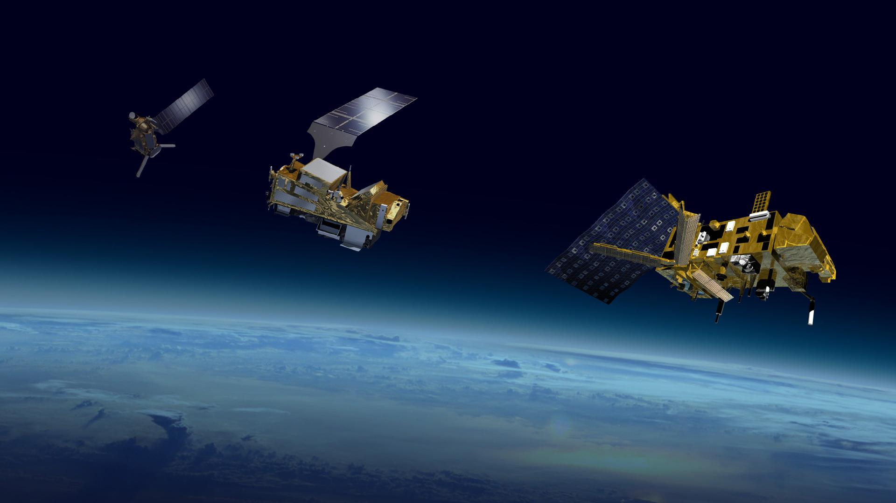
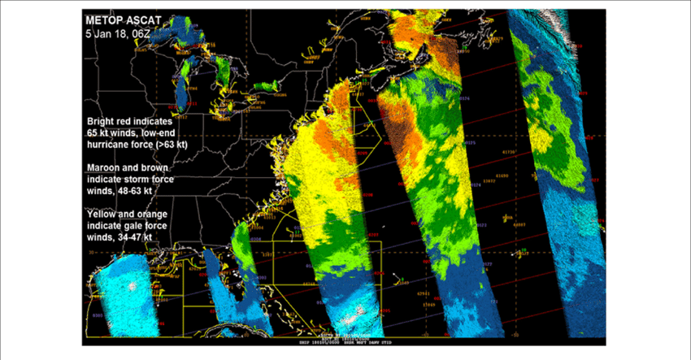
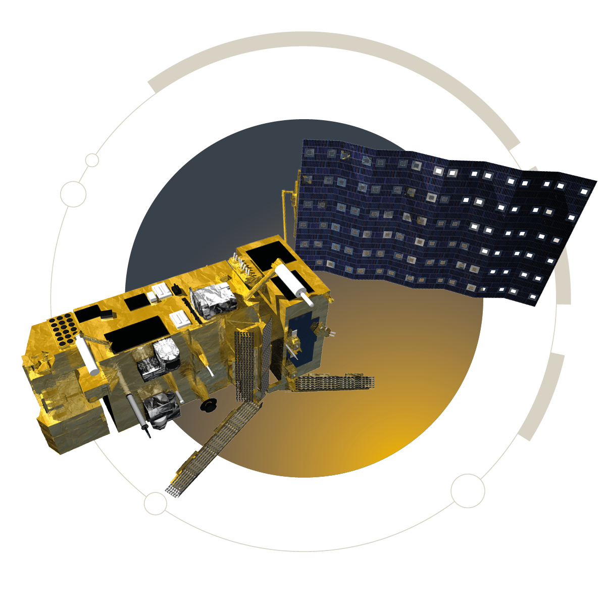
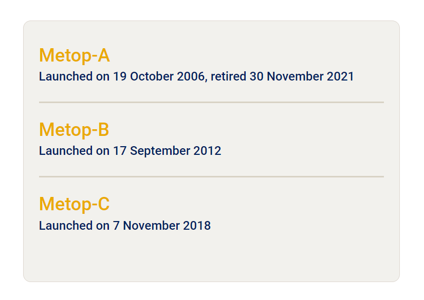
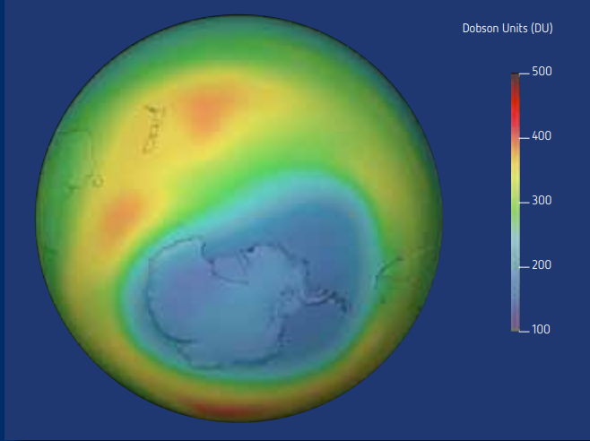

```{r setup, include=FALSE,echo=FALSE}
options(htmltools.dir.version = FALSE)
library(dplyr)
library(readr)
library(readxl)
library(knitr)
```

```{r xaringan-themer, include=FALSE, warning=FALSE}
library(xaringanthemer)
style_duo_accent(primary_color = "#00ABAB", 
                 # secondary_color = "#2881C6",
  header_font_google = google_font("Josefin Sans"),
  text_font_google   = google_font("Montserrat", "300", "300i"),
  code_font_google   = google_font("Fira Mono"),
)
```

```{r xaringan-all, echo=FALSE, warning=FALSE}
library(countdown)
library(xaringan)
library(xaringanExtra)
hook_source <- knitr::knit_hooks$get('source')
knitr::knit_hooks$set(source = function(x, options) {
  x <- stringr::str_replace(x, "^[[:blank:]]?([^*].+?)[[:blank:]]*#<<[[:blank:]]*$", "*\\1")
  hook_source(x, options)
})
xaringanExtra::use_broadcast()
xaringanExtra::use_freezeframe()
xaringanExtra::use_scribble()
#xaringanExtra::use_slide_tone()
xaringanExtra::use_search(show_icon = TRUE, auto_search	=FALSE)
xaringanExtra::use_freezeframe()
xaringanExtra::use_clipboard()
xaringanExtra::use_tile_view()
xaringanExtra::use_panelset()
xaringanExtra::use_editable(expires = 1)
xaringanExtra::use_fit_screen()
xaringanExtra::use_extra_styles(
  hover_code_line = TRUE,         
  mute_unhighlighted_code = TRUE  
)
```

```{r setupbibliography, include=FALSE}
# Code supplied by Andy (see wk2 slides 25-28)
library(RefManageR)
library(knitcitations)
BibOptions(check.entries = FALSE,
           bib.style = "authoryear",
           cite.style = "authoryear",
           style = "markdown",
           hyperlink = TRUE,
           dashed = FALSE,
           no.print.fields=c("doi", "url", "urldate", "issn"))

```

class: center, title-slide, middle

background-image: url("img/1.jpg")
background-size: cover
background-position: center


# Metop series
## Weather satellite
### CASA0023<br/>Introduce Satellite


### `r format(Sys.time(), "%d/%m/%Y")`

---
class: center, middle
# Background

---
class: center, middle

## What is the background to the launch of this series of satellites
---
# Background

.pull-left[
#### As extreme weather events become more frequent and severe, the need for high-resolution weather and climate data grows.
```{r echo=FALSE, out.width='150%', fig.align='right'}

```

]
.pull-right[
- **The MetOp (Meteorological Operational satellite programme)** series of satellites is a series of polar-orbiting meteorological satellites developed by the European Space Agency (ESA) in cooperation with the European Organisation for Meteorological Satellites (EUMETSAT). 
- The project aims to establish and maintain a European polar-orbiting meteorological satellite capability to provide critical data for weather forecasting and climate monitoring worldwide.
]
source:[EUMETSAT](https://www.eumetsat.int/our-satellites/metop-series)
---
# EUMETSAT

<iframe width="890" height="500" src="https://www.youtube.com/embed/JJfi18Y6Kpw?si=tpHeIGPN9qw_Pk5v" title="YouTube video player" frameborder="0" allow="accelerometer; autoplay; clipboard-write; encrypted-media; gyroscope; picture-in-picture; web-share" allowfullscreen></iframe>

---
# Data information
.pull-left[

- Temperature and humidity profiles used to support numerical weather prediction and for making **atmospheric forecasts**
- The total atmospheric content of ozone and the vertical **ozone profile** in the atmosphere
]
.pull-right[
- **wind speed** and direction over the oceans, for use in **weather forecasting**
- Atmospheric water in all of its forms except for **small ice particles**
- **land and sea surface temperature**, cloud cover, snow and ice cover soil moisture, and vegetation.
]

```{r echo=FALSE, out.width='50%', fig.align='center'}

```
Source:[Shawn R. Smith et al.](https://www.researchgate.net/publication/335002224_Ship-Based_Contributions_to_Global_Ocean_Weather_and_Climate_Observing_Systems)
---
# Launch timeline
.pull-left[
```{r echo=FALSE, out.width='1000%', fig.align='middle'}

```
]
.pull-right[
```{r echo=FALSE, out.width='1000%', fig.align='middle'}

```
]
---
#Key features
- **Polar orbit deployment**: MetOp satellites operate in low-Earth orbit at an altitude of approximately 817 kilometres, orbiting the polar regions of the Earth and providing global coverage.

--

- **Advanced instrument portfolio**: Each MetOp satellite carries a range of advanced instruments, including temperature and humidity sounding instruments, Earth observation instruments, and sensors for ocean and land monitoring.

--

- **Data applications**: They provide data for weather forecasting, climate change monitoring, atmospheric composition and gas monitoring, and ocean and land observation.

--

- **Long-term missions**: the MetOp series is designed as a family of multiple satellites to ensure long-term data continuity. metOp-A (launched in 2006), metOp-B (launched in 2012) and metOp-C (launched in 2018) comprise the first satellites in the series.

---
class: inverse, center, middle
# Application
---
# Monitoring climate and environment
.pull-left[
- The Global Ozone Monitoring Experiment-2 (GOME-2), in full synergy with IASI, measures ozone profiles, total column ozone and other atmospheric constituents such as nitrogen dioxide (NO2) and SO2.
- The ability of IASI (Atmospheric Infrared Imaging Spectrometer) to detect and measure trace gases and greenhouse gases provides functionality beyond expectations.
- Monitoring of a range of key climate variables such as temperature, greenhouse gases, aerosol properties, sea ice, and albedo
]
.pull-right[
```{r echo=FALSE, out.width='100%', fig.align='middle'}

```
Atmospheric data from GOME-2 measurements over the Antarctic showing the ozone hole.

Source:DLR, EUMETSAT
]
---
class: inverse, center, middle
# Thanks